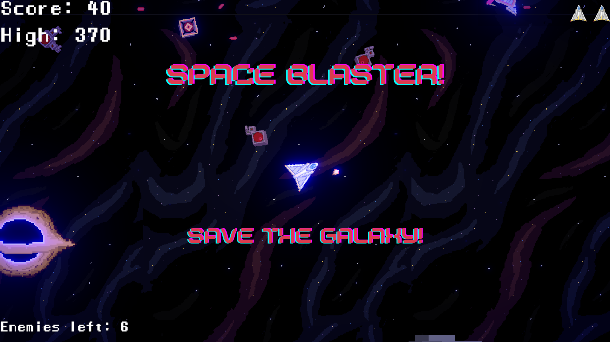

# 2DShooter

- [Infromation](#infromation)
- [The Game](#the-game)
  - [Gameplay](#gameplay)
  - [Unique Features](#unique-features)
- [How to run](#how-to-run)

### Infromation

This is an assignment for NTNU course IDATA2504 where we are going to make a simple 2D shooter game. We have followed the courese from [Coursera](https://www.coursera.org/learn/game-design-and-development-1/home/week/3) to create this project.

## The Game

The game can be played at or downloaded from [itch.io](https://danielneset.itch.io/2dshooter).

### Gameplay

The gameplay is quite simple. You play thru different leves and complete them by eliminating all enemies. This will be done with moving the player and shooting with the mouse. Coursera contribute with everything one need from assets to scripts and easy to follow videos. Some things that was not so good with the course was the use of legecy buttons and text, witch made it look quite outdated.

### Unique features

Some unique features i have added to this game to seperate it a bit from the rest are:

- Power ups to shoot quicker or move faster
- Post processing to make it more visible when you are enpowered
- 5 unique levels with some backstory if you look close
- More UI elements like lives and amounth of enemies left
- A cool main menu with some moving parts
- Volume and SFX controlls using audio mixer (Using PlayerPRefs)

I have learned a lot from this project and look forward to more projects like this. I did a bit extra since i was in the groove and found it quite enjoyable.

## How to run

- [Download Unity](https://unity.com/download)
- Git clone
- Open project in Unity Hub
- Find and press the add button in "Projects" tab
- Select the [2DShooter](/2DShooter/) folder.
- Done :D
